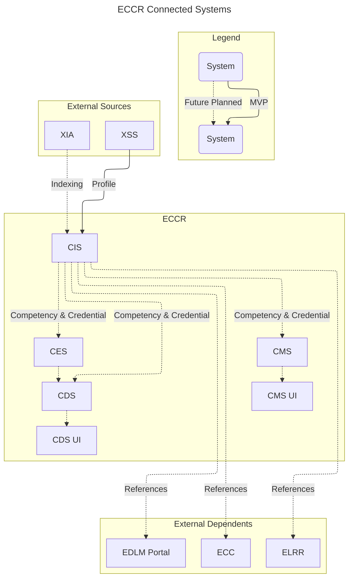

# ECCR-CIS - Competency Index Service
ECCR has been developed based on ECC, with CIS resembling [XIS](https://github.com/adlnet/ecc-openlxp-xis).  This has been done so that ECC components can be used as stand-ins until other ECCR applications are built out.  CIS currently supports the `metadata` API used by XIAs, and the `managed-data` APIs used by [XMS](https://github.com/adlnet/ecc-openlxp-xms).  CIS currently supports reading of relationships, but only supports writing of the domain relationship.

CIS Component is the primary funnel for competency and credential data collected by the XIA components. In addition, the CIS can handle data updates from the [CMS](https://github.com/adlnet/eccr-cms).

Competency and credential data received from XIAs (or manually uploaded) is stored in the associated [Neo4j DB](https://github.com/neo4j/neo4j). Neo4j is used to support the storage of data with non-uniform data schemas, instead data schemas are validated using [XSS/LDSS](https://github.com/adlnet/ecc-openlxp-xss) when it is submitted to the CIS.  Objects are associated with a domain node within the DB, so that the graph and repsonses can be organized.


## ECCR System Architecture




## Workflows
### ETL
ETL pipeline from XIA loads processed competency and credential data into a Neo4j domain after schema validation. Data can also be edited using the APIs directly or CMS, but all edits will also need to pass schema validation prior to saving back to the Neo4j DB.

## Environment variables
- The following environment variables are required:

| Environment Variable | Description                                                                                                                 |
| -------------------- | --------------------------------------------------------------------------------------------------------------------------- |
| DB_HOST              | The host name, IP, or docker container name of the database                                                                 |
| DB_PORT              | The port of the database                                                                                                    |
| DB_NAME              | The name to give the database                                                                                               |
| DB_PASSWORD          | The password for the user to access the database                                                                            |
| DB_USER              | The name of the user to use when connecting to the database. When testing use root to allow the creation of a test database |
| LOG_PATH             | The path to the log file to use                                                                                             |
| SECRET_KEY_VAL       | The Secret Key for Django                                                                                                   |
| NEO4J_BOLT_URI       | The full Bolt URL for the Neo4j Instance                                                                                    |
| NEO4J_URI            | The full URL for the Neo4j Instance (is overriden by NEO4J_BOLT_URI)                                                        |
| NEO4J_USERNAME       | The username to use for the Neo4j Instance                                                                                  |
| NEO4J_PASSWORD       | The password to use for the Neo4j Instance                                                                                  |


## Installation

1. Clone the Github repository:
    - ```git clone https://github.com/adlnet/eccr-cis.git```
    
2. Open terminal at the root directory of the project.
    -  ```example: ~/PycharmProjects/eccr-cis```

3. Run command to install all the requirements from requirements.txt 
    - ```docker-compose build.```

4. Once the installation and build are done, run the below command to start the server.
    - ```docker-compose up```

5. Once the server is up, go to the admin page:
    - http://localhost:8080/admin (replace localhost with server IP)

## Configuration for CIS
1. From the command line of the CIS application run `python manage.py createsuperuser` to create a super user.

2. Navigate over to `http://localhost:8080/admin/` in your browser and log in with the credentials set in step 1.

3. <u>COMPETENCIES</u>
    - Configure Competency Index Service (CIS)
        1. Click on `Competencies` > `Add Configurations`
             - Enter configurations below:
                - Add the `Ldss host`. The host is the hostname/port of XSS/LDSS instance.
            
            **Note: Please make sure to upload schema file in the Experience Schema Server (XSS).**
    - Configure Neo4j Domains
        1. Click on `Competencies` > `Add Django domains`
            - Enter configurations below:
                - `Uuid` is a UUID4. 
                - `Name` is the human readable name of the domain.
    
            **Note: This will create the domain in Neo4j if it doesn't exist.**

## Logs
Logging is written to standard output and the file specified by the LOG_PATH environment variable.

## License

 This project uses the [MIT](http://www.apache.org/licenses/LICENSE-2.0) license.
  
