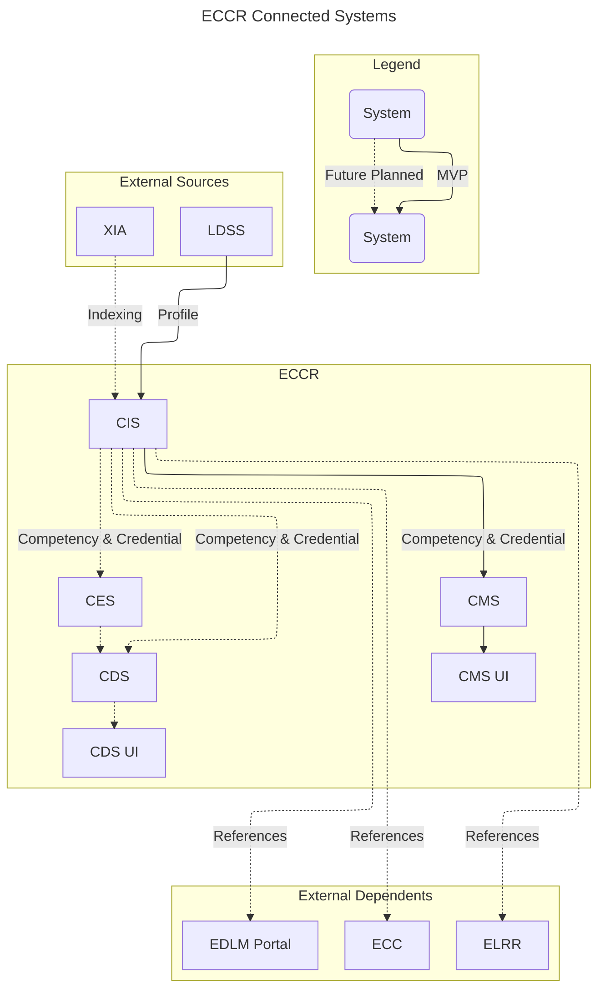
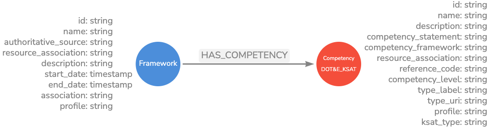
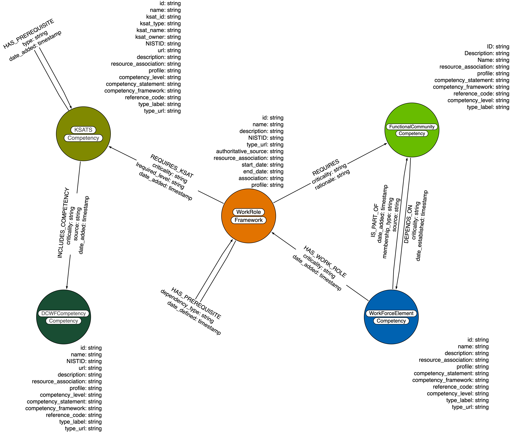

# ECCR-CIS

## ECCR System Architecture



## ECCR Data Diagram

### DOT&E Domain Diagram



### DCWF Domain Diagram



## Overview

The ECCR API provides two main categories of endpoints:

### 1. Competency Management API

- **Frameworks** - Manage competency frameworks (DCWF, SCD 1.0 compliant)
- **Competencies** - Manage individual competencies (Jobs, Work Roles, KSATs)
- **Work Roles** - Manage work role competencies

### 2. Graph Operations API

- **Create Nodes Only** - Create multiple nodes without relationships
- **Create Relationship** - Create two new nodes with a relationship between them
- **Create Relationship to Existing** - Create a new node and relate it to an existing node

All endpoints use JSON schema validation to ensure data integrity and consistency with the defined node profiles.

## Authentication

Currently, no authentication is required for these endpoints. In production, you should implement appropriate authentication and authorization.

## Deployment

The ECCR system runs entirely in Docker containers for easy deployment and development.

### Makefile Benefits

The included Makefile simplifies common development tasks:

- ✅ **Simple Commands**: `make up`, `make test`, `make health`
- ✅ **Consistent Environment**: Same commands across different machines
- ✅ **Error Prevention**: Handles environment variables and paths automatically
- ✅ **Documentation**: `make help` shows all available commands
- ✅ **Development Workflow**: Combines multiple Docker commands into single actions

### Quick Start with Makefile (Recommended)

```bash
# See all available commands
make help

# Start all services (Neo4j + Django API)
make up

# Check service status
make status

# Run all tests
make test

# Stop services
make down
```

### Quick Start with Docker Compose

```bash
# Start all services (Neo4j + Django API)
docker-compose up -d

# Check services are running
docker-compose ps

# View logs
docker-compose logs -f
```

### Docker Management

**Using Makefile:**

```bash
make up              # Start all services
make down            # Stop all services
make build           # Rebuild and start
make restart         # Restart services
make logs            # View all logs
make logs-api        # View API logs only
make health          # Check service health
```

**Using Docker Compose:**

```bash
# Stop all services
docker-compose down

# Rebuild and start (after code changes)
docker-compose up -d --build

# View individual service logs
docker-compose logs -f eccr-backend
docker-compose logs -f neo4j

# Access Django shell in container
docker-compose exec eccr-backend python manage.py shell

# Run Django management commands
docker-compose exec eccr-backend python manage.py migrate
```

### Services

- **Neo4j Database**: `http://localhost:7474` (Browser), `bolt://localhost:7687` (Driver)
- **Django API**: `http://localhost:8080/api/`

### Deployment Modes

**Docker Compose (Recommended):**

- ✅ Complete containerized environment
- ✅ Neo4j + Django API in containers
- ✅ Easy deployment and scaling
- ✅ Consistent environment across dev/prod

**Local Development:**

- ✅ Faster development cycle
- ✅ Direct code changes without rebuilds
- ✅ Neo4j in Docker, Django local
- ✅ Better for debugging and development

## Base URL

**Docker Deployment (Recommended):**

```sh
http://localhost:8080/api/
```

**Local Development:**

```sh
http://localhost:8000/api/
```

All endpoints are accessible under the `/api/` path.

## API Endpoints

### Competency Management Endpoints

#### Frameworks

**List Frameworks:** `GET /api/frameworks/`

- Returns paginated list of competency frameworks
- Supports `?limit=N` parameter for pagination

**Framework Details:** `GET /api/frameworks/{framework_id}/`

- Returns detailed information about a specific framework

**Framework Competencies:** `GET /api/frameworks/{framework_id}/competencies/`

- Returns all competencies associated with a framework

#### Competencies

**List Competencies:** `GET /api/competencies/`

- Returns paginated list of all competencies (Jobs, Work Roles, KSATs)
- Supports `?limit=N` parameter for pagination

**Competency Details:** `GET /api/competencies/{competency_id}/`

- Returns detailed information about a specific competency
- Works for Job, Work Role, and KSAT competencies

#### Work Roles

**List Work Roles:** `GET /api/workroles/`

- Returns paginated list of work role competencies
- Supports `?limit=N` parameter for pagination

**Work Role Details:** `GET /api/workroles/{work_role_id}/`

- Returns detailed information about a specific work role competency

### Graph Operations Endpoints

### 1. Create Nodes Only

**Endpoint:** `POST /api/nodes/`

Creates multiple nodes in the graph without any relationships.

**Request Body:**

```json
{
  "operation": "create_nodes",
  "nodes": [
    {
      "label": "NodeLabel",
      "properties": {
        "id": "unique-identifier",
        "name": "Node Name"
        // ... other properties based on node schema
      }
    }
  ]
}
```

**Response (201 Created):**

```json
{
    "operation": "create_nodes",
    "status": "success",
    "nodes_created": 2,
    "node_ids": ["id1", "id2"],
    "details": {
        "nodes_created": 2,
        "nodes": [...]
    }
}
```

**Example:**

```bash
# Docker deployment
curl -X POST http://localhost:8080/api/nodes/ \
  -H "Content-Type: application/json" \
  -d @create_nodes_only.json

# Local development
curl -X POST http://localhost:8000/api/nodes/ \
  -H "Content-Type: application/json" \
  -d @create_nodes_only.json
```

### 2. Create Relationship

**Endpoint:** `POST /api/relationships/`

Creates two new nodes and establishes a relationship between them.

**Request Body:**

```json
{
    "operation": "create_relationship",
    "source_node": {
        "label": "SourceLabel",
        "properties": { ... }
    },
    "destination_node": {
        "label": "DestLabel",
        "properties": { ... }
    },
    "relationship": {
        "edge_label": "RELATIONSHIP_TYPE",
        "properties": {
            "relationship_type": "type",
            "created_date": "2025-09-19"
        }
    }
}
```

**Response (201 Created):**

```json
{
    "operation": "create_relationship",
    "status": "success",
    "source_node_id": "source-id",
    "destination_node_id": "dest-id",
    "relationship_type": "RELATIONSHIP_TYPE",
    "details": { ... }
}
```

**Example:**

```bash
# Docker deployment
curl -X POST http://localhost:8080/api/relationships/ \
  -H "Content-Type: application/json" \
  -d @create_node_to_node_relationship.json

# Local development
curl -X POST http://localhost:8000/api/relationships/ \
  -H "Content-Type: application/json" \
  -d @create_node_to_node_relationship.json
```

### 3. Create Relationship to Existing

**Endpoint:** `POST /api/relationships/existing/`

Creates a new node and relates it to an existing node in the graph.

**Request Body:**

```json
{
    "operation": "create_relationship_to_existing",
    "new_node": {
        "label": "NewNodeLabel",
        "properties": { ... }
    },
    "existing_node_reference": {
        "label": "ExistingLabel",
        "lookup_method": "by_id",
        "lookup_value": "existing-node-id",
        "description": "Optional description"
    },
    "relationship": {
        "edge_label": "RELATIONSHIP_TYPE",
        "direction": "from_existing_to_new",
        "properties": { ... }
    },
    "validation": {
        "check_existing_node": true,
        "fail_if_not_exists": true,
        "create_if_duplicate": false
    }
}
```

**Response (201 Created):**

```json
{
    "operation": "create_relationship_to_existing",
    "status": "success",
    "new_node_id": "new-node-id",
    "existing_node_reference": { ... },
    "relationship_type": "RELATIONSHIP_TYPE",
    "details": { ... }
}
```

**Example:**

```bash
# Docker deployment
curl -X POST http://localhost:8080/api/relationships/existing/ \
  -H "Content-Type: application/json" \
  -d @create_node_relate_to_existing.json

# Local development
curl -X POST http://localhost:8000/api/relationships/existing/ \
  -H "Content-Type: application/json" \
  -d @create_node_relate_to_existing.json
```

### 4. Health Check

**Endpoint:** `GET /api/health/`

Checks the health of the API and Neo4j database connection.

**Response (200 OK):**

```json
{
  "status": "healthy",
  "database": "connected",
  "timestamp": "..."
}
```

**Response (503 Service Unavailable):**

```json
{
  "status": "unhealthy",
  "database": "error",
  "error": "Connection failed"
}
```

## Data Structure

The ECCR system follows the DCWF (DoD Cyber Workforce Framework) hierarchical structure and is compliant with SCD 1.0 (Structured Competency Description) standards.

### Node Types and Labels

The system uses multi-label nodes to represent the hierarchical structure:

- **Frameworks**: `DCWFFramework:Framework` - Root competency frameworks
- **Competencies**: Various competency types with multiple labels:
  - `Job:Competency` - Job competencies
  - `AdvancedWorkRole:Competency` - Advanced work role competencies
  - `BasicWorkRole:Competency` - Basic work role competencies
  - `IntermediateWorkRole:Competency` - Intermediate work role competencies
  - `KSATSkill:Competency` - Knowledge, Skills, Abilities, and Tasks

### Property Structure

All entities use `id` as the primary identifier (not `uid`) and include:

- `id`: Unique identifier
- `name`: Display name
- `description`: Detailed description
- `domain`: "DCWF" for framework compliance
- `conformsTo`: "SCD 1.0" for standards compliance
- `type_label`: Entity type for classification

### Relationships

The system uses specific relationship types:

- `HAS_SUBFRAMEWORK`: Framework hierarchy relationships
- `REQUIRES`: Competency requirements and dependencies

## Supported Node Types

The API supports the following node types with JSON schema validation:

- `DcwfFramework`
- `Job`
- `AdvancedWorkRole`
- `BasicWorkRole`
- `IntermediateWorkRole`
- `KsatsAbility`
- `KsatsKnowledge`
- `KsatsSkill`
- `KsatsTask`
- `DcwfCompetency`
- `Competency`
- `Framework`
- `FunctionalCommunity`
- `WorkforceElement`

Each node type has its own JSON schema located in `app/eccr/schemas/`.

## Relationship Directions

For the "create relationship to existing" operation, you can specify the relationship direction:

- `from_existing_to_new` - Relationship goes from existing node to new node
- `from_new_to_existing` - Relationship goes from new node to existing node

If not specified, defaults to `from_existing_to_new`.

## Error Responses

### Validation Error (400 Bad Request)

```json
{
  "error": "Validation Error",
  "message": "Detailed error message",
  "errors": ["List of specific validation errors"]
}
```

### Graph Operation Error (422 Unprocessable Entity)

```json
{
  "error": "Graph Operation Error",
  "message": "Detailed error message"
}
```

### Internal Server Error (500)

```json
{
  "error": "Internal Server Error",
  "message": "An unexpected error occurred"
}
```

## Testing & Validation

### Running Tests

The API includes comprehensive test coverage with unit and integration tests.

**Using Makefile (Recommended):**

```bash
make test            # Run all tests
make test-api        # Run competency API tests only
make test-graph      # Run graph operations tests only
make test-integration # Run integration tests only
make test-local      # Run tests with local Python environment
```

**Using Docker Compose:**

**Prerequisites:** Make sure Neo4j is running in Docker:

```bash
# Start Neo4j container (from project root)
docker-compose up -d neo4j

# Verify Neo4j is healthy
docker-compose ps
```

**Run Tests:**

```bash
cd app

# Run all tests with Neo4j connection
NEO4J_BOLT_URI=bolt://localhost:7687 python manage.py test eccr.tests -v 2

# Run specific test categories
NEO4J_BOLT_URI=bolt://localhost:7687 python manage.py test eccr.tests.test_api -v 2        # Competency API tests
NEO4J_BOLT_URI=bolt://localhost:7687 python manage.py test eccr.tests.test_graph_operations -v 2  # Graph operations tests
NEO4J_BOLT_URI=bolt://localhost:7687 python manage.py test eccr.tests.test_integration -v 2      # Integration tests# Alternative: Set environment variable once
export NEO4J_BOLT_URI=bolt://localhost:7687
python manage.py test eccr.tests -v 2
```

### Test Coverage

- **API Tests** (8 tests passing)

  - Framework listing and detail retrieval
  - Competency listing and detail retrieval
  - Work role listing and detail retrieval
  - Framework-competency associations

- **Graph Operations Tests** (14 tests passing)

  - Payload validation tests
  - API endpoint tests with mocked dependencies
  - Repository layer tests
  - Service layer tests

- **Integration Tests** (5 tests passing)
  - Full request/response cycle tests
  - Real JSON schema validation
  - Error handling and edge cases

### Validation Features

✅ **JSON Schema Validation**: All payloads validated against node profile schemas  
✅ **Error Handling**: Comprehensive error responses for validation failures  
✅ **Edge Case Handling**: Invalid labels, missing fields, malformed payloads  
✅ **Data Integrity**: Ensures only valid data reaches the Neo4j database

## Demo Script

A demo script is provided to test all graph operations endpoints:

**Using Makefile:**

```bash
make demo            # Runs demo (starts services if needed)
```

**Docker Deployment:**

```bash
# Start all services
docker-compose up -d

# Run the demo script (API runs on port 8080 in Docker)
NEO4J_BOLT_URI=bolt://localhost:7687 python demo_graph_api.py
```

**Local Development:**

```bash
# Make sure Neo4j container is running
docker-compose up -d neo4j

# Start Django development server
cd app
python manage.py runserver

# Run the demo script (API runs on port 8000 locally)
NEO4J_BOLT_URI=bolt://localhost:7687 python demo_graph_api.py
```

## Implementation Summary

✅ **Successfully Implemented:**

- **Competency Management API** with full CRUD operations for DCWF frameworks and competencies
- **Graph Operations API** with 3 REST endpoints for Neo4j graph data creation
- **JSON Schema Validation** using jsonschema library with 20+ node profile schemas
- **Repository Pattern** for clean data access layer across competencies, frameworks, and graph operations
- **Service Pattern** for business logic separation
- **Multi-Label Node Support** handling complex hierarchical structures (e.g., DCWFFramework:Framework, Job:Competency)
- **SCD 1.0 Compliance** with proper conformsTo properties and domain classifications
- **Comprehensive Error Handling** with proper HTTP status codes
- **Complete Test Suite** with 27 tests (API: 8 passing, Graph Ops: 14 passing, Integration: 5 passing)
- **Documentation** with examples and usage instructions

This implementation provides a robust, well-tested REST API for both competency management and Neo4j graph operations with proper validation, clean architecture patterns, and DCWF/SCD 1.0 compliance.

## Implementation Details

The API follows a layered architecture:

1. **Views Layer** (`eccr/views/graph_operations.py`) - REST API endpoints
2. **Service Layer** (`eccr/services/graph_service.py`) - Business logic
3. **Repository Layer** (`eccr/repositories/graph_repo.py`) - Data access
4. **Validation Layer** (`eccr/utils/validation.py`) - JSON schema validation

This design provides separation of concerns and makes the code maintainable and testable.

## JSON Schema Validation

All node data is validated against JSON schemas before being saved to the database. The schemas are located in `app/eccr/schemas/` and define the required and optional properties for each node type.

## Neo4j Integration

The API uses the Neo4j Python driver to connect to the database. The system is designed to work with Neo4j running in a Docker container.

**Docker Setup:**

```bash
# Start Neo4j with Docker Compose (from project root)
docker-compose up -d neo4j

# Check container health
docker-compose ps

# View logs if needed
docker-compose logs neo4j
```

**Connection Settings:**

Connection settings are configured in Django settings or via environment variables:

- `NEO4J_BOLT_URI` - Neo4j connection URI (default: `bolt://localhost:7687`)
- `NEO4J_USERNAME` - Database username (container uses no auth by default)
- `NEO4J_PASSWORD` - Database password (container uses no auth by default)

**For Testing:** Tests require the `NEO4J_BOLT_URI` environment variable to connect to the Docker container.

**Troubleshooting:**

```bash
# If tests fail with connection errors, check container status
docker-compose ps

# Restart Neo4j container if needed
docker-compose restart neo4j

# Check Neo4j logs for issues
docker-compose logs neo4j

# Verify Neo4j is accepting connections
docker-compose exec neo4j cypher-shell "RETURN 'Neo4j is running!' as message"
```

## Future Enhancements

Potential improvements:

### Competency Management API

1. Competency creation and editing endpoints (POST, PUT, DELETE)
2. Advanced search and filtering capabilities
3. Competency hierarchy visualization endpoints
4. Framework validation and compliance checking
5. Bulk import/export functionality

### Graph Operations API

1. Update and delete operations for existing nodes
2. Bulk operations for better performance
3. Advanced query endpoints with Cypher support
4. Graph traversal and pathfinding endpoints

### System-wide Enhancements

1. Authentication and authorization
2. API versioning and backwards compatibility
3. Rate limiting and performance optimization
4. Enhanced error handling and logging
5. Async processing for large operations
6. Caching for frequently accessed data
7. Real-time notifications for data changes
8. Graph visualization and analytics endpoints
